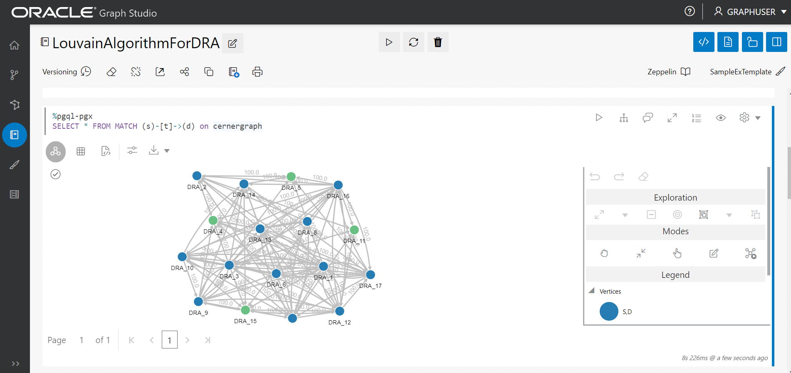

# Run the community detection algorithm

## Introduction

*In this lab, using the graphs which are created in the previous labs, we applied the community detection alogirims which identifies the communities with the graphs. The community detection algorithm takes the input graphs and identities strong connectivity within graphs and forms a smaller communities. It decomposes the monolith database schema(graph) into modular microservice schemas(sub-graphs). 
*Here we used Oracle Graphs for representations and the usage of the Louvain Method via the APIs exposed by the PGX library. 
*Louvain method is used for community detection in this lab.

Estimated Lab Time: 15 minutes

### Objectives

*List objectives for this lab using the format below*

In this lab, you will:
* Identify the smaller communities from the input graph.
* The monolith database schema(graph) is transformed into modular microservice schemas(sub-graphs)

### Prerequisites (Optional)

This lab assumes you have:
* An Oracle account
* All previous labs successfully completed

*This is the "fold" - below items are collapsed by default*

## Task 1: Create a Notebook
	- Oracle Graph Studio > Login using GRAPHUSER 
(optional) Step 1 opening paragraph.

1. Oracle Graph Studio

	

2. Login using GRAPHUSER

  

4. Create a new notebook
	*Go to Notebooks tab 
	
	*click on Create button
	
	*Give a name to notebook
	
	*click on Create button
	
5. Example with bold **text**.

   If you add another paragraph, add 3 spaces before the line.

## Task 2: Run the pgql query on the to see the main graph

1. Create a paragraph
  
2. View the main graph
	<copy>
	%pgql-pgx
	select * from match (s)-[t]->(d) on cerner_graph 
	</copy>

3. Run the paragraph
  
4. You will see the below kind of graph in UI
  
## Task 3: Run the Louvain Algorithm to identify the communities within a graph

1. Create a paragraph
2. Run the louvain algorithm
	<copy>
	%java-pgx
	session.readGraphByName("CERNERGRAPH", GraphSource.PG_VIEW);
	PgxGraph graph = session.getGraph("CERNERGRAPH");
	EdgeProperty<Double> weightProp = graph.getEdgeProperty("TOTAL_AFFINITY");
	VertexProperty<?, Long> communityProp = analyst.louvain(graph, weightProp,1);
	String communityPropName = communityProp.getName();
	for (PgxResult result : graph.queryPgql("SELECT v." + communityPropName + " MATCH (v) GROUP BY v." + communityPropName +"")) {
		long communityId = result.getLong(1); // get the id of the community
		out.println("communityId : " + communityId);
		// iterate through the vertices from that community listed by PGQL
		for (PgxResult resultVertices : graph.queryPgql("SELECT v MATCH (v) where v." + communityPropName + " = " + communityId)) {
			PgxVertex<?> vertex = resultVertices.getVertex(1); // get the vertex
			out.println("vertex : " + vertex);
		}
	}
	</copy>

3. Run the paragraph
  

## Learn More

## Acknowledgements
* **Author** - Praveen Hiremath, Developer Advocate
* **Contributors** -  Praveen Hiremath, Developer Advocate
* **Last Updated By/Date** - Praveen Hiremath, Developer Advocate, May 2022 

