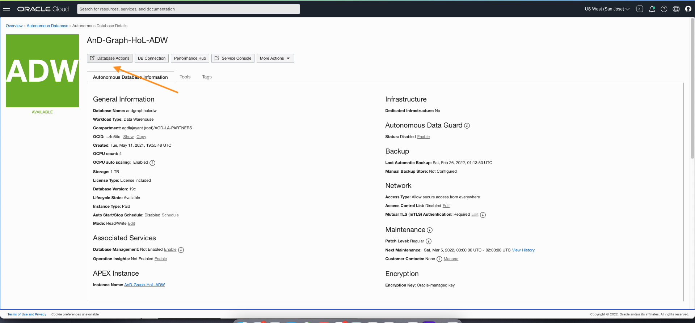

# Construct a graph using the collected data

## Introduction

In this lab, we will create the graph model from the data which are extracted from the previous labs for which tables and the affinity the between the tables are calculated.

Estimated Lab Time: 15 minutes

### Objectives

In this lab :
- Using the Graph Studio, We are gonna extract the smaller graph from the main graph as the analysis will be easier and easy to understand as well.

### Prerequisites (Optional)

This lab assumes you have:
* An Oracle account
* This lab requires an Autonomous Database - Shared Infrastructure or Autonomous Transaction Processing - Shared Infrastructure account.

## Task 1: Run the Infomap on the main graph in the Data Studio
#TODO:

1. Open the service detail page for your Autonomous Database instance in the OCI console.  

   Then click the **Database Actions** link to open it. 
   
   

## Task 2: Choose the clusters from the result of Infomap from the main graph

1. Tables from the cluster related to Personal Details of Patient

   - ESO_TRIGGER,PRSNL_ORG_RELTN,PROBLEM_COMMENT,MATCH_TAG_PARMS,CODE_CDF_EXT,CREDENTIAL,FILL_CYCLE_BATCH,DEPT_ORD_STAT_SECURITY,WORKING_VIEW_FREQ_INTERVAL,PRSNL_RELTN,PE_STATUS_REASON,PERSON_CODE_VALUE_R,CMT_CONCEPT,SCH_LOCK,PROC_PRSNL_RELTN,TRACKING_EVENT_HISTORY,CODE_VALUE_SET,PERSON_PRSNL_RELTN,DOSE_CALCULATOR_UOM,CLINICAL_SERVICE_RELTN,ENCNTR_PRSNL_RELTN,PREDEFINED_PREFS,PSN_PPR_RELTN,CODE_VALUE_EXTENSION,PRSNL,CODE_VALUE,PRSNL_RELTN_ACTIVITY,CMT_CONCEPT_EXTENSION

2. Tables from the cluster related to Medications

	- ORDER_CATALOG_ITEM_R,WARNING_LABEL_XREF,PACKAGE_TYPE,MED_IDENTIFIER,MED_PACKAGE_TYPE,MED_PRODUCT,MANUFACTURER_ITEM,WARNING_LABEL,MED_FLEX_OBJECT_IDX,MED_DEF_FLEX,ITEM_LOCATION_COST,QUANTITY_ON_HAND,MED_DISPENSE,MEDICATION_DEFINITION,MED_COST_HX,MED_INGRED_SET,MED_OE_DEFAULTS,RX_CURVE
   
3. Tables from the cluster related to Orders

	- RENEW_NOTIFICATION_PERIOD,ORDER_REVIEW,BILL_ONLY_PROC_RELTN,FILM_USAGE,ORDER_CATALOG_SYNONYM,ORDERS,ORDER_INGREDIENT,ORDER_CATALOG,SCH_APPT_ORD,ORDER_ACTION,ORDER_IV_INFO,RAD_PROCEDURE_ASSOC,ORDER_NOTIFICATION,RAD_PRIOR_PREFS,RAD_FOLLOW_UP_RECALL,ACTIVITY_DATA_RELTN,ECO_QUEUE

    

4. Tables from all 3 clusters in sql format. We call this as TABLES_FROM_SELECTED_CLUSTERS_IN_SQL_FORMAT   

   - 'ESO_TRIGGER','PRSNL_ORG_RELTN','PROBLEM_COMMENT','MATCH_TAG_PARMS','CODE_CDF_EXT','CREDENTIAL','FILL_CYCLE_BATCH','DEPT_ORD_STAT_SECURITY','WORKING_VIEW_FREQ_INTERVAL','PRSNL_RELTN','PE_STATUS_REASON','PERSON_CODE_VALUE_R','CMT_CONCEPT','SCH_LOCK','PROC_PRSNL_RELTN','TRACKING_EVENT_HISTORY','CODE_VALUE_SET','PERSON_PRSNL_RELTN','DOSE_CALCULATOR_UOM','CLINICAL_SERVICE_RELTN','ENCNTR_PRSNL_RELTN','PREDEFINED_PREFS','PSN_PPR_RELTN','CODE_VALUE_EXTENSION','PRSNL','CODE_VALUE','PRSNL_RELTN_ACTIVITY','CMT_CONCEPT_EXTENSION','ORDER_CATALOG_ITEM_R','WARNING_LABEL_XREF','PACKAGE_TYPE','MED_IDENTIFIER','MED_PACKAGE_TYPE','MED_PRODUCT','MANUFACTURER_ITEM','WARNING_LABEL','MED_FLEX_OBJECT_IDX','MED_DEF_FLEX','ITEM_LOCATION_COST','QUANTITY_ON_HAND','MED_DISPENSE','MEDICATION_DEFINITION','MED_COST_HX','MED_INGRED_SET','MED_OE_DEFAULTS','RX_CURVE','RENEW_NOTIFICATION_PERIOD','ORDER_REVIEW','BILL_ONLY_PROC_RELTN','FILM_USAGE','ORDER_CATALOG_SYNONYM','ORDERS','ORDER_INGREDIENT','ORDER_CATALOG','SCH_APPT_ORD','ORDER_ACTION','ORDER_IV_INFO','RAD_PROCEDURE_ASSOC','ORDER_NOTIFICATION','RAD_PRIOR_PREFS','RAD_FOLLOW_UP_RECALL','ACTIVITY_DATA_RELTN','ECO_QUEUE'
   
5. Fetch TABLE1 and TABLE2 names from edges and combine both names, remove the duplicates by keeping only unique table names. 

   - 
	SELECT DISTINCT TABLE1 FROM EDGES_974 WHERE TABLE1 IN (TABLES_FROM_SELECTED_CLUSTERS_IN_SQL_FORMAT) 
	OR TABLE2 IN (TABLES_FROM_SELECTED_CLUSTERS_IN_SQL_FORMAT);
	
   - 
	SELECT DISTINCT TABLE2 FROM EDGES_974 WHERE TABLE1 IN (TABLES_FROM_SELECTED_CLUSTERS_IN_SQL_FORMAT)
	OR TABLE2 IN (TABLES_FROM_SELECTED_CLUSTERS_IN_SQL_FORMAT);

	Merge the result of above 2 queries and have the tables of connected nodes as well. We call it as TABLES_INCLUDING_CONNECTED_NODES. 
	The below are the resultant tables
	- ('WARNING_LABEL_XREF','BILL_ITEM','SCH_APPT','ACCESSION','TRACKING_PRV_RELN','ORDER_CONTAINER_R','PE_STATUS_REASON','ORGANIZATION','PROC_PRSNL_RELTN','SIGN_LINE_FORMAT_DETAIL','SHARED_LIST_GTTD','ORG_ALIAS_POOL_RELTN','ORDER_CATALOG','PERSON_NAME','TRACK_EVENT','ENCNTR_INFO','ORDER_ENTRY_FIELDS','TRACKING_EVENT_HISTORY','CHARGE_EVENT_ACT','MED_COST_HX','ORDER_ACTION','SCH_EVENT_ALIAS','ECO_QUEUE','MLTM_NDC_MAIN_DRUG_CODE','PREDEFINED_PREFS','UCMR_CASE_TYPE','LOCATION','FILL_PRINT_ORD_HX','SCH_EVENT_ATTACH','ESI_LOG','MANUFACTURER_ITEM','ACCESSION_ORDER_R','BLOB_REFERENCE','V500_EVENT_SET_CODE','ORDER_DISPENSE','HM_EXPECT_MOD','ALT_SEL_CAT','SIGN_LINE_FORMAT','SCH_EVENT_PATIENT','CODE_VALUE_GROUP','ORDER_SENTENCE','SCD_TERM_DATA','ITEM_DEFINITION','CODE_VALUE_EVENT_R','RAD_INT_CASE','PRSNL','CODE_VALUE_EXTENSION','PERSON_INFO','ACTIVITY_DATA_RELTN','ENCNTR_PRSNL_RELTN','PROBLEM','LOGICAL_DOMAIN','TRACK_REFERENCE','PRSNL_GROUP_RELTN','DCP_FORMS_ACTIVITY_COMP','TASK_ACTIVITY','RAD_EXAM','PAT_ED_FAVORITES','MED_PRODUCT','ORDERS','REACTION','ORDER_INGREDIENT','ALT_SEL_LIST','DCP_SHIFT_ASSIGNMENT','IMAGE_CLASS','SCH_LOCK','SCH_EVENT','TRACK_GROUP','ACT_PW_COMP','PM_TRANSACTION','DCP_CARE_TEAM_PRSNL','PERSON_ALIAS','TRACKING_EVT_CMT','PW_CAT_SYNONYM','SCH_APPT_ORD','CODE_VALUE_SET','PPR_CONSENT_STATUS','PAT_ED_DOC_ACTIVITY','MED_OE_DEFAULTS','REGIMEN_CATALOG','STICKY_NOTE','SCH_LOCATION','CE_MED_RESULT','ORDER_TASK','ORDER_CATALOG_SYNONYM','PERSON_COMBINE_DET','ORDER_DETAIL','NURSE_UNIT','RAD_TECH_CMT_DATA','CODE_CDF_EXT','RAD_PROTOCOL_DEFINITION','ORG_BARCODE_FORMAT','COLLECTION_PRIORITY','RAD_PROTOCOL_ACT','NETTING','SCH_ENTRY','CHARGE_EVENT','HM_EXPECT_MOD_HIST','ORG_BARCODE_ORG','V500_EVENT_SET_EXPLODE','ORDER_PRODUCT_DOSE','SCH_SIMPLE_ASSOC','PRSNL_ALIAS','MED_DISPENSE','DISPENSE_CATEGORY','RAD_FOL_UP_FIELD','PATHWAY','IM_STUDY','CODE_VALUE_ALIAS','DIAGNOSIS','RX_CURVE','CMT_CONCEPT_EXTENSION','RAD_RES_INFO','ALLERGY','ALLERGY_COMMENT','IM_STUDY_PARENT_R','PRSNL_ORG_RELTN','PCS_DEMOGRAPHIC_FIELD','DEVICE','OE_FORMAT_FIELDS','MED_PACKAGE_TYPE','RAD_RPT_LOCK','PRSNL_RELTN','CHARGE_EVENT_ACT_PRSNL','PPR_CONSENT_POLICY','MED_DEF_FLEX','RAD_REPORT','RAD_FOLLOW_UP_RECALL','UCM_CASE_STEP','MAMMO_FOLLOW_UP','TRACKABLE_OBJECT','MAMMO_STUDY','CODE_VALUE','TRACKING_PRSNL','SCR_PATTERN','ENCNTR_LOC_HIST','PHARMACY_NOTES','SCH_EVENT_ACTION','ENCNTR_ALIAS','LONG_BLOB','PW_CAT_FLEX','PERSON_PRSNL_ACTIVITY','FILM_USAGE','DEPT_ORD_STAT_SECURITY','MED_FLEX_OBJECT_IDX','TASK_ACTIVITY_ASSIGNMENT','PROBLEM_PRSNL_R','CE_EVENT_PRSNL','PERSON_PRSNL_RELTN','MEDICATION_DEFINITION','RAD_REPORT_PRSNL','CMT_CONCEPT','ORDER_INGREDIENT_DOSE','LONG_TEXT','TRACKING_CHECKIN','TASK_DISCRETE_R','ORDER_RADIOLOGY','QUANTITY_ON_HAND','PM_WAIT_LIST_STATUS','RAD_FOLLOW_UP_CONTROL','EXAM_DATA','ICLASS_PERSON_RELTN','MEDIA_EXAM','TRACKING_EVENT','ESO_TRIGGER','MRU_LOOKUP_ED_DOC','PROBLEM_COMMENT','TEMPLATE_NONFORMULARY','PROCEDURE_SPECIMEN_TYPE','SCH_APPT_OPTION','PERSON','PRICE_SCHED','PERSON_PERSON_RELTN','PAT_ED_SHORTCUT','MED_IDENTIFIER','RAD_PROCEDURE_GROUP','ORDER_COMMENT','FILL_CYCLE_BATCH','WORKING_VIEW_FREQ_INTERVAL','PERSON_COMBINE','LOCATION_GROUP','ORDER_IV_INFO','PERSON_CODE_VALUE_R','DCP_FORMS_ACTIVITY_PRSNL','ORDER_THERAP_SBSTTN','OUTPUT_DEST','CONTAINER','ORDER_NOTIFICATION','TASK_RELTN','SIGN_LINE_DTA_R','SERVICE_DIRECTORY','REGIMEN_CAT_SYNONYM','PSN_PPR_RELTN','MED_INGRED_SET','PAT_ED_RELTN','SCD_STORY','ORDER_CATALOG_ITEM_R','RENEW_NOTIFICATION_PERIOD','CE_EVENT_ACTION','PHONE','TRACKING_LOCATOR','CS_COMPONENT','PACKAGE_TYPE','MATCH_TAG_PARMS','ORDER_REVIEW','CREDENTIAL','BILL_ONLY_PROC_RELTN','PCT_CARE_TEAM','RAD_FILM_ADJUST','UCM_CASE','FILM_EXAM','CLINICAL_EVENT','ORDER_TASK_RESPONSE','PFT_ENCNTR','WARNING_LABEL','ORD_RQSTN_ORD_R','PENDING_COLLECTION','PATHWAY_CATALOG','DCP_FORMS_ACTIVITY','ORDER_PRODUCT','NOMENCLATURE','ORDER_SUPPLY_REVIEW','TRACKING_ITEM','RAD_INT_CASE_R','RAD_PRIOR_PREFS','PRIV_LOC_RELTN','ITEM_LOCATION_COST','ORDER_LABORATORY','PRSNL_GROUP','DOSE_CALCULATOR_UOM','RAD_PROCEDURE_ASSOC','CLINICAL_SERVICE_RELTN','ENCOUNTER','PRSNL_RELTN_ACTIVITY','ORDER_TASK_XREF','EXPEDITE_COPY','SYNONYM_ITEM_R','ORG_TYPE_RELTN','PRINTER','ORG_ORG_RELTN','OCS_FACILITY_R','IMAGE_CLASS_TYPE','DEVICE_XREF','DCP_ENTITY_RELTN','RAD_INIT_READ','ROUTE_FORM_R','RAD_REPORT_DETAIL','PROXY_GROUP','TRACKING_PRSNL_REF','OUTBOUND_FIELD_PROCESSING','CODE_SET_EXTENSION','DRC_PREMISE','PRIVILEGE','PROC_CLASSIFICATION','TRACKING_EVENT_ORD','SHARED_VALUE_GTTD','BILL_ITEM_MODIFIER','DISCRETE_TASK_ASSAY','RES_SIGN_ACT_SUBTYPE')

	
## Task 3:Create new tables for the extracted data.

1. Create new NODES table of the graph. 

   - 
   CREATE TABLE NODES_259_NEW AS SELECT * FROM NODES_974 WHERE TABLE_NAME IN (TABLES_INCLUDING_CONNECTED_NODES)

2. Create new EDGE table of the graph.    
   -
	CREATE TABLE EDGES_259_NEW AS 
	SELECT * FROM EDGES_974 WHERE 
	TABLE1 IN (TABLES_FROM_SELECTED_CLUSTERS_IN_SQL_FORMAT) OR 
	TABLE2 IN (TABLES_FROM_SELECTED_CLUSTERS_IN_SQL_FORMAT);

3. Adding the constraints for the newly extracted data
 
   - 
	alter table NODES_259_NEW add primary key (TABLE_NAME);
	alter table EDGES_259_NEW add primary key (table_map_id);
	alter table EDGES_259_NEW modify TABLE1 references NODES_259_NEW (TABLE_NAME);
	alter table EDGES_259_NEW modify TABLE2 references NODES_259_NEW (TABLE_NAME);
	commit;

4. Export the data from NODES_259_NEW and EDGES_259_NEW tables to CSV files
	1. NODES_259_NEW.csv
	2. EDGES_259_NEW.csv  

Please **proceed to the next lab** to do so.

## Acknowledgements
* **Author** - Praveen Hiremath, Developer Advocate
* **Contributors** -  Praveen Hiremath, Developer Advocate
* **Last Updated By/Date** - Praveen Hiremath, Developer Advocate, September 2022 

## Learn More

